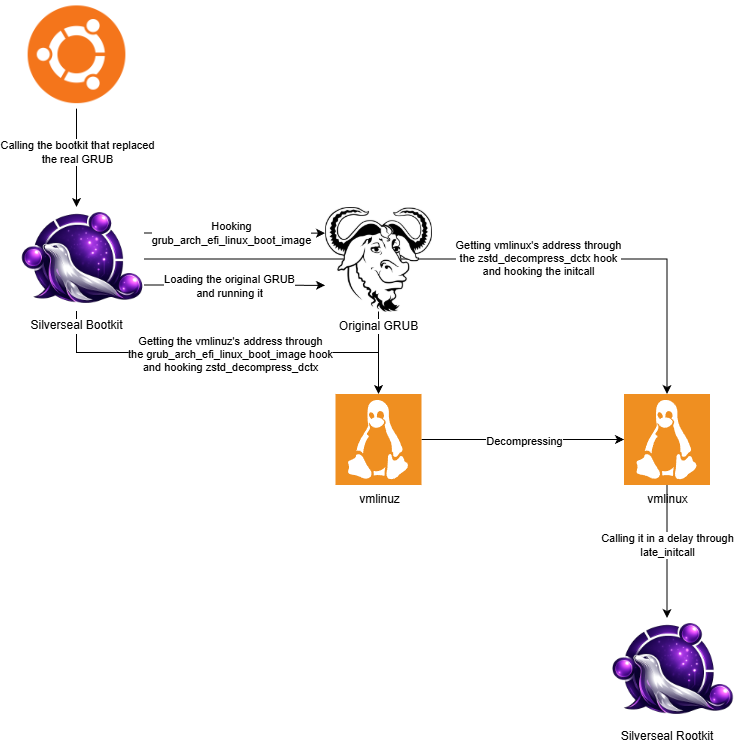

# Silverseal


Silverseal is a Linux framework containing a bootkit and a rootkit.

## Design



## Installing Dependencies

### Ubuntu

Installs the packages needed for Rust-for-Linux external module builds, installs `rustup` if needed, switches the default toolchain to `stable`, adds `rust-src`, installs `bindgen-cli`, and warns if the currently running kernel does not expose `CONFIG_RUST=y`.

```bash
./scripts/install_dependencies.sh
```

### WSL

> ![IMPORTANT]  
> If you're using WSL, make sure to set up WSL 2 and install Ubuntu. This script builds a custom Rust-enabled WSL2 kernel, prepares a modules VHDX, and can optionally write a Windows `.wslconfig` entry that points WSL at the generated kernel.

```bash
./scripts/wsl_setup.sh
```

The script automatically installs the Ubuntu build dependencies, clones the matching Microsoft WSL2 kernel source, enables `CONFIG_RUST`, builds the kernel with LLVM, and wires `/lib/modules/<release>/build` for external module builds.

To see the supported options:

```bash
./scripts/wsl_setup.sh --help
```

To build the rootkit against your wanted target kernel, you need to run the following script on your build machine (either WSL or a native Linux machine):

```bash
./scripts/ubuntu_target_setup.sh <uname -r of your target kernel>
```

This flow installs the matching `linux-headers-<kernel>` and `linux-lib-rust-<kernel>` packages, installs the Ubuntu-packaged Rust 1.82 toolchain used by the generic-kernel flow, repairs `/usr/src/linux-headers-<kernel>/rust` if that symlink is broken, and prints the exact `make` command to use afterward.

## Build

### Rootkit

Build the rootkit with the kernel build system. Do not use Cargo for the real module build.

```bash
cd Silverseal/silverseal-rootkit
make
```

The module artifacts are staged into `silverseal-rootkit/target/` after the build.

Build the rootkit for an Ubuntu generic target kernel from WSL:

```bash
cd Silverseal/silverseal-rootkit
make clean
PATH=/usr/bin:/bin:$PATH \
RUST_LIB_SRC=/usr/src/rustc-1.82.0/library \
make RUST_MIN_TOOLCHAIN= \
KDIR=/usr/src/linux-headers-6.17.0-20-generic \
CC=x86_64-linux-gnu-gcc-13 \
RUSTC=rustc-1.82 \
RUSTDOC=rustdoc-1.82
```

The module Makefile auto-detects `/usr/src/linux-headers-*` targets and passes the Rust compatibility cfg through Kbuild's Rust flag variables so the newer Ubuntu `module!` metadata schema uses `authors` instead of the older `author` key.

After the build, verify the target kernel version was embedded correctly:

```bash
modinfo target/silverseal_rootkit.ko | grep vermagic
```

### Bootkit

The bootkit build requires `nasm` on `PATH`. The crate is already configured to target `x86_64-unknown-uefi`, and the build script assembles both `asm/x64/lkm_loader.asm` and `asm/x64/lkm_stager.asm` into flat binary blobs embedded into the EFI image.

```bash
cd Silverseal/silverseal-bootkit
cargo build --release
```

The resulting EFI binary is written to:

```bash
Silverseal/target/x86_64-unknown-uefi/release/silverseal-bootkit.efi
```

## Test

The deployment script currently expects a file named `silverseal-bootkit.efi` in the repository root. After building the bootkit, copy the EFI artifact there and then run the setup script from the repository root.

```bash
cd Silverseal
cp target/x86_64-unknown-uefi/release/silverseal-bootkit.efi ./silverseal-bootkit.efi
sudo ./scripts/setup_silverseal.sh
```

The script performs a direct swap on the EFI partition:

- moves `/boot/efi/EFI/ubuntu/grubx64.efi` to `/boot/efi/EFI/ubuntu/grubx64.efi.original`
- moves `./silverseal-bootkit.efi` into place as `/boot/efi/EFI/ubuntu/grubx64.efi`

## Remove Silverseal

To remove Silverseal, restore the original GRUB binary from the `.original` backup:

```bash
cd Silverseal
sudo ./scripts/restore_silverseal.sh
```

## Serial Logging Setup

### Linux

- **Identify the serial port:**

```bash
ls -la /dev/ttyS*
```

Common ports: `/dev/ttyS0` (COM1), `/dev/ttyS1` (COM2)

- **Monitor serial output with `minicom`:**

```bash
sudo minicom -D /dev/ttyS0 -b 115200

# Or with `screen`:
sudo screen /dev/ttyS0 115200

# Or with `picocom`:
sudo picocom -b 115200 /dev/ttyS0
```

### Windows

- Download and run [PuTTY](https://www.putty.org/)
- Select "Serial" connection type
- Enter the serial line you created in the VM (e.g., `\\.\pipe\com_1`)
- Set speed to 115200
- Under Connection > Serial, set "Flow control" to "None" and "Parity" to "None"
- Click Open

You can also use the helper script, which continuously reconnects PuTTY to `\\.\pipe\com_1` at `115200` baud:

```powershell
powershell -ExecutionPolicy Bypass -File .\scripts\connect-vm.ps1
```

## Resources

- [UEFI Crate](https://rust-osdev.github.io/uefi-rs/how_to/protocols.html)
- [Elixir Bootlin](https://elixir.bootlin.com/linux)
- [memN0p's Bootkit](https://github.com/memN0ps/redlotus-rs)
